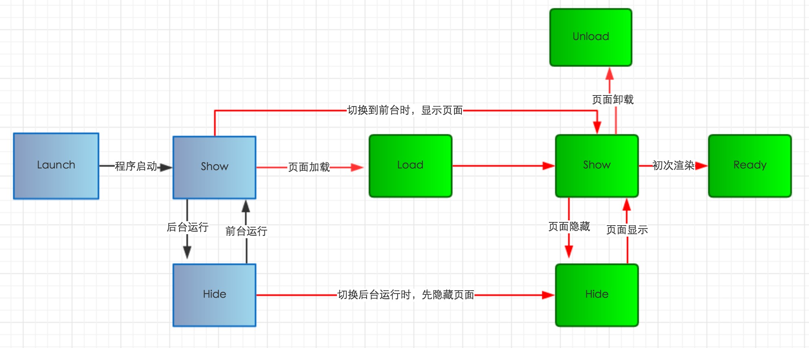

# 小程序开发课程


## 主流小程序平台简介

* [微信小程序](https://developers.weixin.qq.com/miniprogram/dev/index.html)
* [支付小程序](https://docs.alipay.com/mini/developer/getting-started)
* [百度小程序](https://smartprogram.baidu.com/docs/develop/tutorial/codedir/)
* [头条小程序](https://developer.toutiao.com/docs/framework/)

## 微信小程序的定位

我们先说一下，使用各家原生方式开发的可行性。小程序这一概念是最初是有微信官方提出的。

#### 微信小程序主要策略

1、在信息繁杂的时代让信息获取的唾手可得

2、设立线下入口，通过二维码连接线上和线下

**目标：实现新营销、新零售、新社交**

## 开发者眼中的小程序

依附于原生Application，提供的类似于原生应用交互体验的应用程序

**1、** 具有原生应用的交互体验的

**2、** 可扩展界面和功能的

**3、** XML模板 + Javascript脚本 + Css样式排版的

**4、** 提供了各种原生App功能的

## 开发方式

### 原生开发简介

#### **微信端** 官方提供基本结构介绍

```
├── app.js   // 小程序入口业务逻辑  
├── app.json // 小程序公共设置
├── app.wxss // 小程序页面公共样式
├── pages
│   │── index
│   │   ├── index.wxml  // 页面模板
│   │   ├── index.js    // 页面业务逻辑
│   │   ├── index.json  // 页面配置
│   │   └── index.wxss  // 页面样式
│   └── logs
│       ├── logs.wxml
│       └── logs.js
└── utils
```

微信原生开发详解


#### **支付宝端** 官方提供基本结构介绍

```
├── app.js   // 小程序入口业务逻辑  
├── app.json // 小程序公共设置
├── app.acss // 小程序页面公共样式
├── pages
│   │── index
│   │   ├── index.axml  // 页面模板
│   │   ├── index.js    // 页面业务逻辑
│   │   ├── index.json  // 页面配置
│   │   └── index.acss  // 页面样式
│   └── logs
│       ├── logs.axml
│       └── logs.js
└── utils
```


**文件结构**

小程序分为 `app` 和 `page` 两层。

`app` 用来描述整体程序，`page` 用来描述各个页面。

`app` 由三个文件组成，必须放在项目的根目录：

| 文件  | 必填  | 作用 |备注|
|:---:|:---:|:---:|:---:|
|app.js				| 是	| 小程序逻辑	|
|app.json 			| 是	| 小程序公共设置|
|app.(wxss \| acss)	| 否	| 小程序公共样式表|wxss为微信端/acss为支付宝端 |

`page` 由四个文件组成，分别是：

| 文件类型  | 必填  | 作用 |备注|
|:---:|:---:|:---:|:---:|
|js				| 是	| 小程序逻辑	|
|wxml \| axml	| 是	| 小程序公共样式表| wxml为微信端/axml为支付宝端 |
|wxss \| acss	| 否	| 小程序公共样式表| wxss为微信端/acss为支付宝端 |
|json 			| 否	| 小程序公共设置|


### 小程序的生命周期



> App和Page的生命周期支付宝和微信小程序基本一致

`App生命周期`

* `onLaunch` 小程序启动
* `onShow` 小程序切换到前台
* `onHide` 小程序切换到后台
* `onError` 小程序出错 

`Page生命周期`

* `onLoad` 页面被加载
* `onShow` 页面被显示
* `onReady` 页面首次加载完成
* `onUnload` 页面被关闭
* `onHide` 页面被切隐藏


从上图结构可以了解。小程序原先开发的项目结构并无很大差异，只是文件后缀名存在差异


> 支付宝和微信端组件的声明周期存在很大的差异

*微信端* `Component生命周期` [详细介绍](https://developers.weixin.qq.com/miniprogram/dev/framework/custom-component/lifetimes.html)

* `created` 在组件实例刚刚被创建时执行
* `attached` 在组件实例进入页面节点树时执行
* `ready` 在组件在视图层布局完成后执行
* `moved` 在组件实例被移动到节点树另一个位置时执行
* `detached` 在组件实例被从页面节点树移除时执行
* `error` 每当组件方法抛出错误时执行

*支付宝端* `Component生命周期` [详细介绍](https://docs.alipay.com/mini/framework/component-overview)

* `onInit` 组件创建时触发
* `deriveDataFromProps` 组件创建时和更新前触发
* `didMount` 组件创建完毕时触发
* `didUpdate` 组件更新完毕时触发	
* `didUnmount` 组件删除时触发


原生开发详解

* [微信小程序开发详解](./mini-wx.md)

* [支付宝小程序开发详解](./mini-alipay.md)

* 其他平台大同小异暂不做介绍

### 第三方框架

市面上比较流行的开源框架

* [`chameleon`](https://gitee.com/didiopensource/chameleon) Vue栈 滴滴平台开源
* [`uni-app`](https://gitee.com/dcloud/uni-app)  Vue栈 dcloude开源
* [`megalo`](https://github.com/kaola-fed/megalo)  Vue栈 网易考拉开源
* [`Mpvue`](https://github.com/Meituan-Dianping/mpvue/) Vue栈 美团点评开源
* [`taro`](https://github.com/NervJS/taro) React栈 京东凹凸实验室开源
* [`okam `](https://github.com/ecomfe/okam) Vue栈 百度FE团队
* 等等


#### 框架选型和对比

从上面所列举的较为流行的一套代码生成多端小程序的框架可见，现在流行的三方框架都是基于两大MVVM框架实现的（即React/Vue）。原因是主流的2个视图框架可以有效的转换为各小程序端需求的页面和项目结构


## 文章引用
 [微信小程序介绍](http://baijiahao.baidu.com/s?id=1604933097076124042&wfr=spider&for=pc) - http://baijiahao.baidu.com/s?id=1604933097076124042&wfr=spider&for=pc
