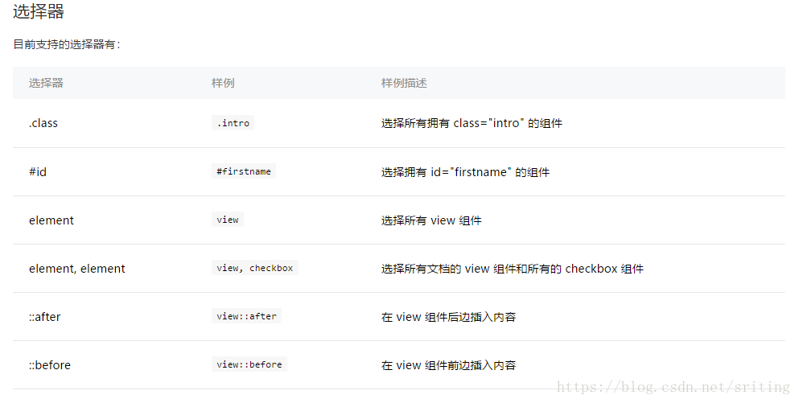

# 小程序-微信端

```
├── app.js   // 小程序入口业务逻辑  
├── app.json // 小程序公共设置
├── app.wxss // 小程序页面公共样式
├── pages
│   │── index
│   │   ├── index.wxml  // 页面模板
│   │   ├── index.js    // 页面业务逻辑
│   │   ├── index.json  // 页面配置
│   │   └── index.wxss  // 页面样式
│   └── logs
│       ├── logs.wxml
│       └── logs.js
└── utils
```

## 配置

* 全局配置 app.json
	
	配置小程序应用的公共属性 [查看](https://developers.weixin.qq.com/miniprogram/dev/reference/configuration/app.html)
	
	
* 页面配置 pages目录下的.json文件

	配置单个页面属性 [查看](https://developers.weixin.qq.com/miniprogram/dev/reference/configuration/page.html)

## wxml语法

wxml语法从本质上看，就可以认为是xml标准的xml，只是我们认为对某种占位符代表特定的含义 [详细解释查看](https://developers.weixin.qq.com/miniprogram/dev/reference/wxml/)


### 数据绑定

以下例子中用到的`message`，`id`是个变量

* `{{ }}` 输出内容,支持语法
 * 三元运算
 
 ```
 <view hidden="{{flag ? true : false}}">Hidden</view>
 ```
 
 * 算数运算

 ```
 //若a=1, b=2, c =3 , d =4
 <view>{{a + b}} + {{c}} + d</view>   //渲染内容： 334
 ```
 * 逻辑判断
 
 ```
 // length类型：Integer
 <view wx:if="{{length > 5}}"></view>
 ```
 
 * 字符串运算

 ```
 //name类型： String/Number
 <view>{{"hello" + name}}</view>
 ```
 
 * 数据路径运算
 
 ```
 //展示集合或对象的数据
 <view>{{object.key}} {{array[0]}}</view>
 ```
 
 * 组合
 
 ```
 //生成新的集合或对象
 <view wx:for="{{[zero, 1, 2, 3, 4]}}">{{item}}</view>
 ```

### 列表渲染

组件上使用`wx:for`控制属性 数组的渲染

> 默认数组的当前项的下标变量名默认为`index`，数组当前项的变量名默认为 `item`

> * 使用 wx:for-item 可以指定数组当前元素的变量名

> * 使用 wx:for-index 可以指定数组当前下标的变量名

```
//例子1：简写，省略的定义
<view wx:for="{{array}}">
  {{index}}: {{item.message}}
</view>
//模板对应的page.js
Page({
  data: {
    array: [{
      message: 'foo',
    }, {
      message: 'bar'
    }]
  }
})
```


```
//例子2： 自定义item和index名称
<view 
	wx:for="{{array}}" 
	wx:for-index="idx" 
	wx:for-item="itemName">
  {{idx}}: {{itemName.message}}
</view>
//模板对应的page.js
Page({
  data: {
    array: [{
      message: 'foo',
    }, {
      message: 'bar'
    }]
  }
})
```

### 条件渲染

条件渲染是所有程序员必须用到的语法规则，那就简单点一下了。

wxml中条件语句与程序中的保持一致，都分为3类型， `wx:if`、`wx:elif`、`wx:else`, 格式如下：

```
//条件渲染模板
<view wx:if="{{length > 5}}">1</view>
<view wx:elif="{{length > 2}}">2</view>
<view wx:else>3</view>
```

### 渲染中的Block组件

由于xml格式规则，所有标签必须闭合，而在通常的模板开发中，经常会出现（如下代码），使用block的有点是，在循环或条件判断时，可以减少标签的渲染数量，`提升渲染性能` [详细介绍](https://developers.weixin.qq.com/miniprogram/dev/framework/view/wxml/conditional.html)

```
//原格式
<view wx:for="{{arr}}">
	<view>{{item.name}}<view>
	<view>{{item.age}}<view>
<view>

//使用block后
<block wx:for="{{arr}}">
	<view>{{item.name}}<view>
	<view>{{item.age}}<view>
</block>
```

### wxss样式

wxss可以狭义的理解它就是css3，不过略语不同，如下： [查看详细文档](https://developers.weixin.qq.com/miniprogram/dev/framework/view/wxss.html)




使用自定义字体：

* `font-family`  在定义自定义字体时，`@font-face` 暂时只支持base64使用方式

### WXS 模块 

**本期暂不介绍，待之后更新**

## API

本章简单介绍几组常用API

> 路由[介绍](https://developers.weixin.qq.com/miniprogram/dev/api/wx.navigateBack.html)
>  
> * `switchTab` 跳转到 tabBar 页面，并关闭其他所有非 tabBar 页面
> * `reLaunch` 关闭所有页面，打开到应用内的某个页面
> * `redirectTo` 关闭当前页面，跳转到应用内的某个页面。但是不允许跳转到 tabbar 页面。
> * `navigateTo` 保留当前页面，跳转到应用内的某个页面,最大层级10层
> * `navigateBack` 关闭当前页面，返回上一页面或多级页面
> 
> 交互[介绍](https://developers.weixin.qq.com/miniprogram/dev/api/wx.showToast.html)
> 
> * `showToast` 显示消息提示框
> * `hideToast` 隐藏消息提示框
> * `showModal` 显示模态对话框
> * `showLoading` 显示 loading 提示框。需主动调用 wx.hideLoading 才能关闭提示框
> * `hideLoading` 隐藏 loading 提示框
>
> 网络[介绍](https://developers.weixin.qq.com/miniprogram/dev/api/wx.request.html)
> 
> * `request` 发起 HTTPS 网络请求
> * `downloadFile` 下载文件资源到本地, 客户端直接发起一个 HTTPS GET 请求，返回文件的本地临时路径 
> * `uploadFile` 将本地资源上传到服务器。客户端发起一个 HTTPS POST 请求，其中 content-type 为 multipart/form-data 
>
> 数据缓存[介绍](https://developers.weixin.qq.com/miniprogram/dev/api/wx.setStorageSync.html)
> 
> * `setStorage`/`setStorageSync` 将数据存储在本地缓存（异步/同步）
> * `removeStorage`/`removeStorageSync` 从本地缓存中移除指定key异步/同步）
> * `getStorage`/`/getStorageSync` 从本地缓存中异步获取指定 key 的内容异步/同步）
> * `getStorageInfo`/`getStorageInfoSync` 异步获取当前storage的相关信息（异步/同步）
> * `clearStorage`/`clearStorageSync`清理本地数据缓存 异步/同步）

以上只列了极少部分常用api，更多API请见[官方文档](https://developers.weixin.qq.com/miniprogram/dev/api/)

### 自定义组件


## api