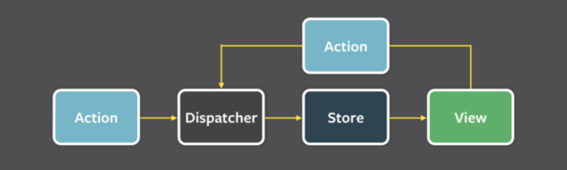
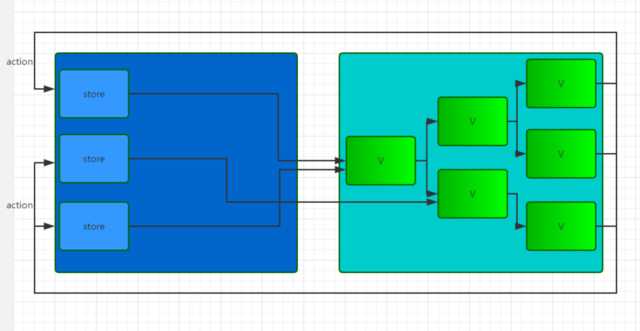
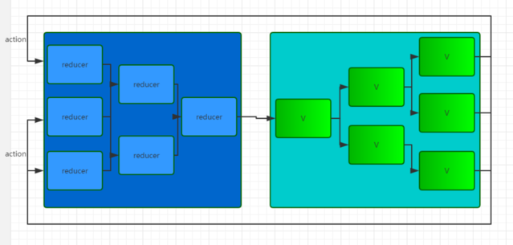

## Taro 开发心得

笔者：吴佳雷 <wjl19890427@hotmail.com>


在开始Taro前，大家先回顾一下:

###  React

React 起源于 Facebook 的内部项目，是一套`MVVM`(Model-View-ViewModel)框架，于2013年5月开源

当说到`MVVM`框架时，大家一定听说过：`MVC`、`MVP` [阮一峰MVC，MVP 和 MVVM介绍](http://www.ruanyifeng.com/blog/2015/02/mvcmvp_mvvm.html)

我们知道了MVVM 其实是分为：`M`模型 + `V`视图 + `VM`视图模型

主流的MVVM框架：`React`、`Vue`、`Angular`(额外提供Controller层)

React Demo

`建议`：React组件命名必须以首字符大写，是为了区别通过HTML标签定义的JSX

```
import {Component} from 'react'
import PropsType from 'prop-types'

//React组件名称class生命必须以首字符大写
class MyReactComponent extends Component {}
```


### JSX

* JSX是一种JavaScript的语法扩展
* JSX的特性更接近JavaScript而不是HTML
* JSX必须编写闭合标签

看下JSX 例子：

```
//这是JSX - 我是一个对象
const elementJSX = <div index="0">name</div>;

//这是html - 我是一个字符串
const elementHtml = '<div index="0">name</div>';

```

以上例子JSX和HTML本质的不同，JSX代码得到的是一个Object对象，而html为一个字符串。

JSX简介 - [了解JSX基本使用方式入口](https://www.jianshu.com/p/c4b0ed711ce7)

###  Flux概念

> Flux是什么？

* Flux核心思想：数据和逻辑永远单向流动。

* Flux是一种思想、一种应用架构。

Flux思想示意图：




> Flux的实现库 - [facebook/flux](https://github.com/facebook/flux)



> Redux类flux库 - [reduxjs/redux](https://github.com/reduxjs/redux)




### Taro 开发

Taro 是由凹凸实验室打造的一套遵循 React 语法规范的多端统一开发框架


#### 安装

```
npm install -g @tarojs/cli

//查看帮助文档
taro --help
```

#### 创建项目

```
//创建项目myapp
taro init myapp
```

#### 运行项目

```
//微信小程序打包, --watch 代表监听文件变化
taro build --type weapp --watch

//百度小程序打包
taro build --type swan --watch

//其他平台请查看命令行工具
```

#### 工程结构

```
├── config                 配置目录
|   ├── dev.js             开发时配置
|   ├── index.js           默认配置
|   └── prod.js            打包时配置
├── src                    源码目录
|   ├── components         公共组件目录
|   ├── pages              页面文件目录
|   |   ├── index          index 页面目录
|   |   |   ├── banner     页面 index 私有组件
|   |   |   ├── index.js   index 页面逻辑
|   |   |   └── index.css  index 页面样式
|   ├── utils              公共方法库
|   ├── app.css            项目总通用样式
|   └── app.js             项目入口文件
└── package.json
```

Taro框架对通过内部转换将一个React代码转换为各端代码。

#### Taro生命周期

|生命周期函数| 类型 |对标小程序| 描述|
|:---:|:---:|:---:|:---:|
|componentWillMount| React自带 | Page.onLoad、App.onLaunch| 组件将被挂在|
|componentDidMount| React自带| Page.onReady | 组件已被挂在|
|componentDidShow | Taro 新增 | Page.onShow、App.onShow | 组件可见 |
|componentDidHide | Taro 新增 | Page.onHide、App.onHide | 组件不可见 |
|componentDidCatchError | Taro新增 | App.onError | 出现内部变异错误|
|componentDidNotFound | Taro新增 | App.onPageNotFound | 页面不存在| 
|shouldComponentUpdate | React自带 | 无 | 判断组件是否需要更新|
|componentWillUpdate | React自带 | 无 | 组件即将更新前 |
|componentDidUpdate | React自带 | 无 | 组件已更新 |
| componentWillUnmount| React 自带 | Page.onUnload | 组件将被销毁 |

#### Taro创建页面

Taro统一使用Component组件创建小程序下的App，Page,Component对象

```
import {Component} from "@tarojs/taro"
```

Taro框架默认使用：app.js为项目入口文件

简单看下app.js结构：

在Taro中，App入口和页面入口组件都可以设定config配置，而自定义组件入口无config配置

config设置注意点：

config配置只支持`静态化`，原因是由于该备注将在编译过程中被提取成静态的JSON配置。

app入口配置可以参考小程序配置项：

* `config.pages` 

*描述整个项目有多少个页面，其中对应pages目录下的每个页面.js/.ts文件*

* `config.window` 

*设置小程序窗口配置*

* `config.tabBar`

*设置应用的tabBar设置*

**其他的配合请参考各家小程序配置项**


> app.js示例：

```
//添加taro对async-await语法的支持
import "@tarojs/async-await";
import Taro, { Component } from "@tarojs/taro";
import { Provider } from "@tarojs/redux";
import configStore from "./store";
import Index from "./pages/index";
/* 项目自有样式 */
import "./app.less";

const store = configStore();

class App extends Component {
  /**
   * app配置只能是静态配置无法动态配置，
   * 可以参考各家小程序的app配置项
   */
  config = {
    //小程序的路由描述
    pages: [
      "pages/home",
      "pages/found"
    ],
    window: {
      backgroundTextStyle: "light",
      navigationBarBackgroundColor: "#fff",
      navigationBarTitleText: "WeChat",
      navigationBarTextStyle: "black"
    },
    tabBar: {
      backgroundColor: "#ffffff",
      borderStyle: "black",
      color: "#4D4D4D",
      selectedColor: "#ED0000",
      list: [
        {
          pagePath: "pages/home",
          text: "首页",
          iconPath: "/assets/tabbars/tab_shouye.png",
          selectedIconPath: "/assets/tabbars/tab_shouye_sele.png"
        },
        {
          pagePath: "pages/found",
          text: "搜索",
          iconPath: "/assets/tabbars/tab_sousuo.png",
          selectedIconPath: "/assets/tabbars/tab_sousuo_sele.png"
        }
      ]
    }
  };

  componentDidMount() {}

  componentDidShow() {}

  componentDidHide() {}

  componentDidCatchError() {}

  render() {
    return (
      <Provider store={store}>
        <Index />
      </Provider>
    );
  }
}

Taro.render(<App />, document.getElementById("app"));
```

> 页面文件示例：

```
import { Component } from "@tarojs/taro";
import { View } from "@tarojs/components";
//使用taro-ui
import { AtTabs, AtTabsPane } from "taro-ui";
import { connect } from "@tarojs/redux";
//引用组件banner和banners
import Banners from "@/components/widgets/banners";
import Banner from "@/components/widgets/banner";
import "./home.less";

class Home extends Component {
  state = {
    current: 0
  };

  //页面配置
  config = {
    navigationBarTitleText: "首页"
  };

  constructor(props) {
    super(props);
    this.handleClick = this.handleClick.bind(this);
    this.myTabEvent = this.myTabEvent.bind(this);
  }

  componentDidMount() {
    this.props.getInfo();
  }

  componentWillReceiveProps() {}

  componentWillUnmount() {}

  componentDidShow() {}

  componentDidHide() {}

  handleClick(value) {
    this.setState({
      current: value
    });
  }

  myTabEvent(value, index) {
  }

  render() {
    const tabs = [
      { title: "热门" },
      { title: "女装" }
    ];
    return (
      <View className="container-fixed">
        <AtTabs
          tabDirection="horizontal"
          current={this.state.current}
          scroll
          tabList={tabs}
          onClick={this.handleClick}
        >
          {tabs.map((v, k) => (
            <AtTabsPane current={this.state.current} index={k}>
              <Banner
                src="https://shop-image.lianwifi.com/Fm6OqrNKHB_CjsvlPX3rzPGBydfx?1559031524"
                extend={{}}
              />
              <Banners
                className="name"
                class="name1"
                banners={tabs}
                onTapEvent={this.myTabEvent}
              />
            </AtTabsPane>
          ))}
        </AtTabs>
      </View>
    );
  }
}

export default connect(
  ({ system }) => {
    return {
      system
    };
  }
)(Home);

```

#### Taro与React开发异同

> 相同点：

* 几乎一致的React开发体验
* 支持组件式开发
* 支持自定义事件

> 不同点：

* 自定义事件命名必须以on开头(原因由于小程序机制问题，小程序自定义组件自定义事件命名只支持on开头)
* 新增不同生命周期
* 组件通过使用方式的不同分为：应用、页面、组件这三个隐形状态，各自含有不同的生命周期函数。

### 相关文章来源

阮一峰的网络日志

MVC，MVP 和 MVVM 的图示 - [http://www.ruanyifeng.com/blog/2015/02/mvcmvp_mvvm.html](http://www.ruanyifeng.com/blog/2015/02/mvcmvp_mvvm.html)

JSX简介 - [了解JSX基本使用方式入口](https://www.jianshu.com/p/c4b0ed711